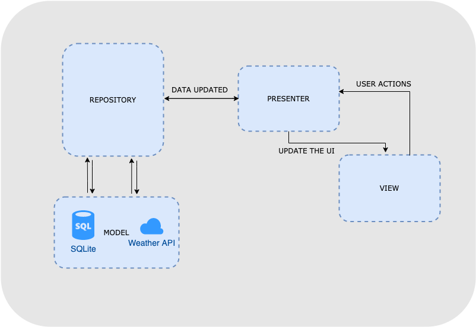
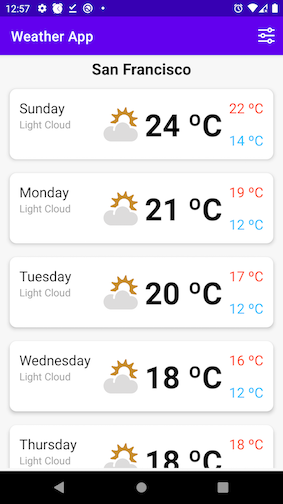
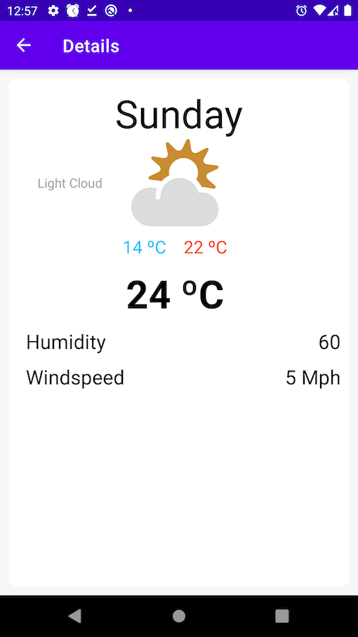
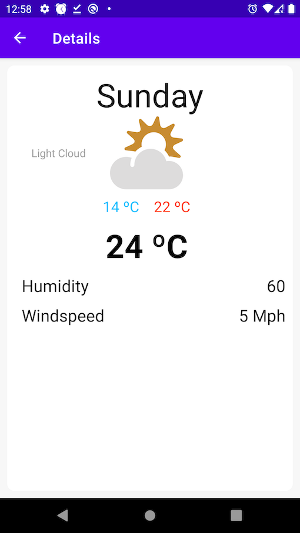

# App Name
Weather

# Description
The app shows the values about the weather for a specific city, you can choose the city on the settings. The main screen shows the values for the current and next 6 days,  showing values like minimum, maximum, and average of the temperature and the weather status too. The detail screen shows more detail about the day.

# Architecture
This application was developed using the MPV with Repository. Each part has your responsibility without mixed responsibilities. 
Views only handle the user interactions and update the UI. 
Presenter controls the logic and calls the new data from the repository and sends the new model for the View to update the UI. 
Repository manages the model, using API and Database, and interacts with the presenter with the model updated. 

# Built With
DataBinding - Field and method binding for Android views 
Retrofit - A type-safe HTTP client for Android and Java 
Metaweather - Weather API used 
Gson - A Java serialization/deserialization library to convert Java Objects into JSON and back. 
Navigation Component - Navigation refers to the interactions that allow users to navigate across, into, and back out from the different pieces of content within your app. 
Room Database - The Room persistence library provides an abstraction layer over SQLite to allow fluent database access while harnessing the full power of SQLite. Note: not completely implemented, still work in progress. 
Junit - JUnit is a simple framework to write repeatable tests. It is an instance of the xUnit architecture for unit testing frameworks. 

# UI
Using attributes to enable the app to run with good colors in dark and light mode. Note: not completely implemented, still work in progress. 
  

# Requirements
Android 5.0 (API 21) or above 
Build with Android Studio 3.0 Beta 2 

